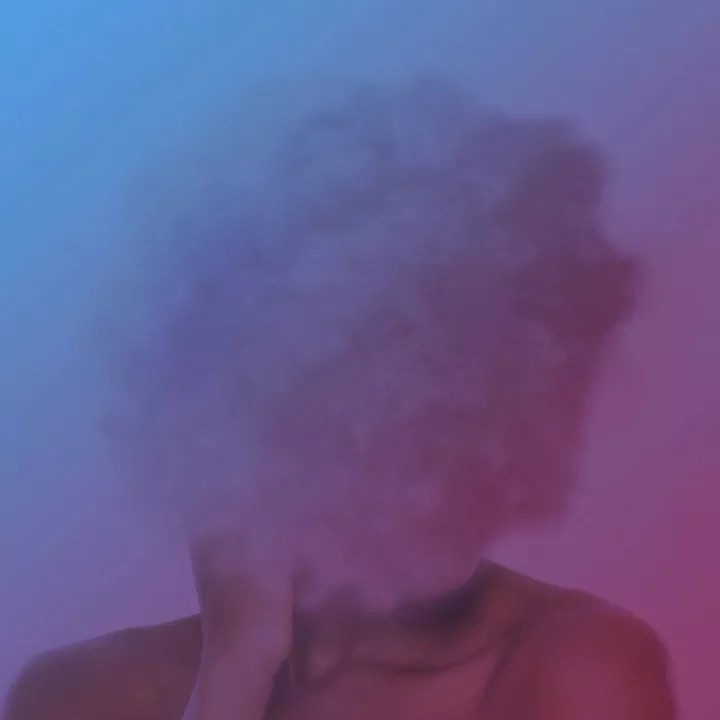

# The past, present and future

__2021 was a fantastic year for this project as we shipped many new awesome
features, saw significant user growth and leveraged GitHub Sponsors to make the
project sustainable.__

<aside style="display: flex;font-size: px2rem(13.6px);" markdown>
<!--  -->
<!-- ![@squidfunk][@squidfunk avatar] -->
<!-- { width="40px" border-radius=100%} -->

__Martin Donath__ · @squidfunk

:octicons-calendar-24: December 27, 2021 ·
:octicons-clock-24: 10 min read

</aside>

  [@squidfunk avatar]: https://avatars.githubusercontent.com/u/932156

---
